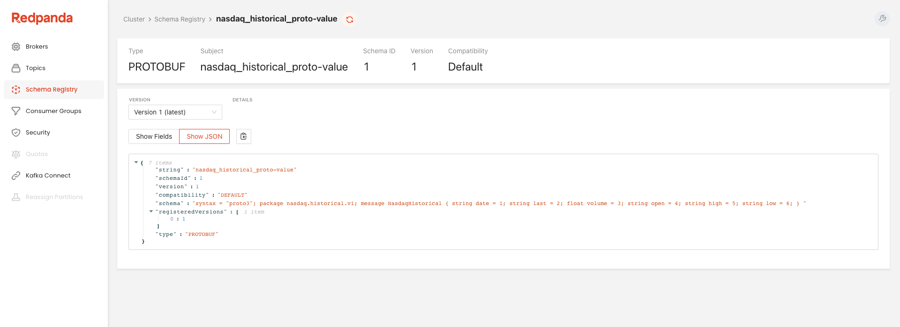
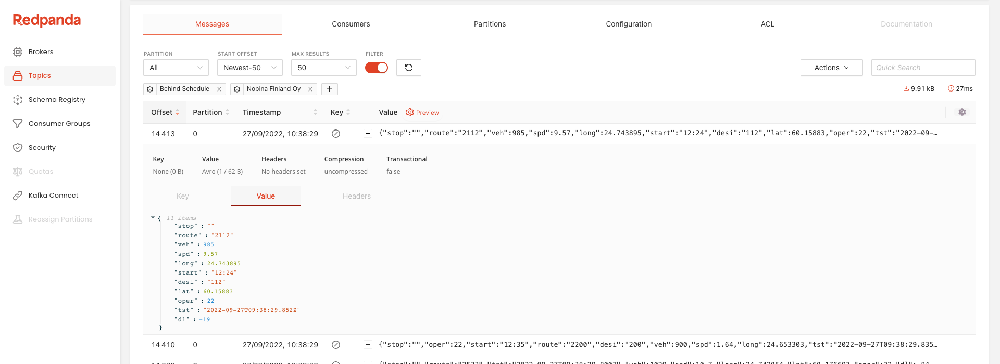

# Redpanda Console Demo

https://docs.redpanda.com/docs/console/

## Setup environment

Start a local Redpanda cluster and Redpanda Console using the provided Docker Compose file:

```shell
docker-compose up -d
[+] Running 7/7
 ⠿ Network redpanda-console_default      Created
 ⠿ Container redpanda1                   Started
 ⠿ Container redpanda2                   Started
 ⠿ Container redpanda3                   Started
 ⠿ Container debezium-connect            Started
 ⠿ Container debezium-mysql              Started
 ⠿ Container redpanda-console            Started
```

Once the containers have started, Redpanda Console will be available at http://localhost:8080.

## Produce JSON data (Go)

The [data](./data/) folder contains historical stock data for four symbols. The data can be downloaded from the [Nasdaq](https://www.nasdaq.com/market-activity/stocks/coke/historical) website in CSV format.

Run the [Go](./go/main.go) application to read the data files in parallel, transform each line from CSV to JSON, and send the messages to a Redpanda topic named `nasdaq_historical`. The application intentionally slows the stream down by adding a small delay after producing each message, and another delay before committing offsets on the consumer side to simulate lag. This example does not use the Schema Registry.

```shell
cd go
go run main.go -brokers localhost:19092,localhost:29092,localhost:39092
```


## Produce Protobuf data (Java)

The [Protobuf](https://developers.google.com/protocol-buffers/) example uses the same historical stock data as above, but uses [Confluent's Protobuf Schema Serializer and Deserializer](https://docs.confluent.io/platform/current/schema-registry/serdes-develop/serdes-protobuf.html) to send Protobuf messages to a Redpanda topic named `nasdaq_historical_proto`. The Java-based library registers the Protobuf schema in the Schema Registry, which is subsequently used by Redpanda Console to [deserialize messages](https://docs.redpanda.com/docs/console/features/record-deserialization/) into JSON for [filtering](https://docs.redpanda.com/docs/console/features/programmable-push-filters/).

```shell
cd java
mvn clean compile assembly:single
java -jar target/protobuf-example-1.0.0-jar-with-dependencies.jar
```



## Push Filters for Nasdaq data

Use Redpanda Console's [push filters](https://docs.redpanda.com/docs/console/features/programmable-push-filters/) to search for specific messages in the `nasdaq_historical` or `nasdaq_historical_proto` topics.

**Note** that you might have to provide a custom offset to see the results (e.g. start offset: `0`, max results: `50`)

1. Filter the topic by the key `NVDA` and the record year `2022`:

```javascript
var parts = value.Date.split("/");
return (key == "NVDA") && (parts[2] == "2022")
```

2. Include only the records that have had a 10% increase in value:

```javascript
var open = parseFloat(value.Open.slice(1));
var close = parseFloat(value.Last.slice(1));
return 100/open*close > 110
```


## Produce Avro data (Javascript)

The Javascript example connects to the [Digitransit High-Frequency Positioning (HFP) API](https://digitransit.fi/en/developers/apis/4-realtime-api/vehicle-positions/) and subscribes to the Helsinki public transport vehicle movements firehose. Buses, trains, and trams in the Helsinki area publish their status once per second in MQTT format, with the message payload provided as UTF-8 encoded JSON strings.

The [hfp-producer.js](./js/hfp-producer.js) script subscribes to the HFP API for vehicle positions (`/hfp/v2/journey/ongoing/vp/#`) and transforms all MQTT messages to Avro (with schema registry encoding) before forwarding to a Redpanda topic. The [Avro schema](./js/vp.avsc) is registered in the Redpanda schema registry.

```shell
cd js
node hfp-producer.js -b localhost:19092 -r http://localhost:18081
```

The [hfp-consumer.js](./js/hfp-consumer.js) script subscribes to the Redpanda topic and consumes the Avro messages. It uses the Avro schema registry encoding to retrieve the associated Avro schema from the Redpanda schema registry and uses it to deserialise the messages, printing them to the console in JSON string format.

```shell
cd js
node hfp-consumer.js -b localhost:19092 -r http://localhost:18081
```

## Push Filters for HFP API data

Use Redpanda Console's [push filters](https://docs.redpanda.com/docs/console/features/programmable-push-filters/) to search for specific messages in the `digitransit-hfp` topic.

1. Apply a filter on the `dl` field to determine which vehicles are behind schedule (i.e. running late for their next stop):

```javascript
return value.dl < 0;
```

2. Include only the records from a given public transport operator. See the Digitransit documentation for a [full list of operators](https://digitransit.fi/en/developers/apis/4-realtime-api/vehicle-positions/#operators):

```javascript
// Nobina Finland Oy
return value.oper == 22;
```



## Debezium + MySQL

Demonstrate a change data capture (CDC) worflow with [Kafka Connect](https://kafka.apache.org/documentation/#connect), [Debezium](https://debezium.io/), and [MySQL](https://www.mysql.com/).

### Check out the example MySQL schema

```shell
docker exec -it debezium-mysql /bin/bash

mysql -u mysqluser -pmysqlpw

USE inventory;
SHOW TABLES;
SELECT * FROM customers;
```

### Configure the Debezium connector

```shell
curl \
  --request POST \
  --url http://localhost:8083/connectors \
 	--header 'Content-Type: application/json' \
 	--data '{
  	"name": "inventory-connector",
   	"config": {
    	"connector.class": "io.debezium.connector.mysql.MySqlConnector",
     	"tasks.max": "1",
     	"database.hostname": "mysql",
     	"database.port": "3306",
     	"database.user": "debezium",
     	"database.password": "dbz",
     	"database.server.id": "184054",
     	"database.server.name": "dbserver1",
     	"database.include.list": "inventory",
     	"database.history.kafka.bootstrap.servers": "redpanda1:9092,redpanda2:9092,redpanda3:9092",
     	"database.history.kafka.topic": "schema-changes.inventory"
 		}
	}' | jq '.'

curl --request GET \
     --url http://localhost:8083/connectors/inventory-connector/status | jq '.'
```

### Consume the customers topic

```shell
export REDPANDA_BROKERS=localhost:19092,localhost:29092,localhost:39092

rpk topic list
NAME                                  PARTITIONS  REPLICAS
dbserver1                             1           1
dbserver1.inventory.addresses         1           1
dbserver1.inventory.customers         1           1
dbserver1.inventory.geom              1           1
dbserver1.inventory.orders            1           1
dbserver1.inventory.products          1           1
dbserver1.inventory.products_on_hand  1           1
inventory.configs                     1           1
inventory.offset                      25          1
inventory.status                      5           1
schema-changes.inventory              1           1

rpk topic consume dbserver1.inventory.customers --offset start
```

5. Update the customers table in MySQL

```sql
INSERT INTO customers VALUES (1005, "Jared", "Hall", "jared@redpanda.com");
INSERT INTO customers VALUES (1006, "Kevin", "Marowatsanga", "kevin@vectorized.com");
UPDATE customers SET email="kevin@redpanda.com" WHERE id=1006;
```

The changes will appear in the `dbserver1.inventory.customers` topic in Redpanda.